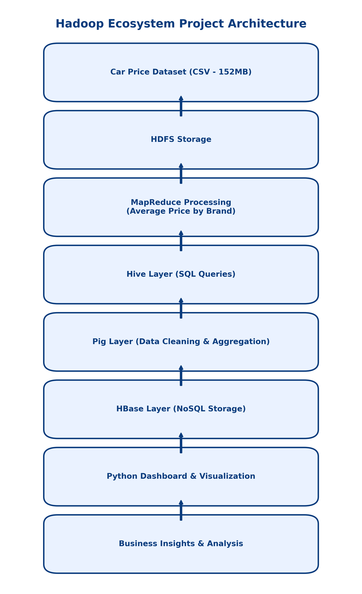
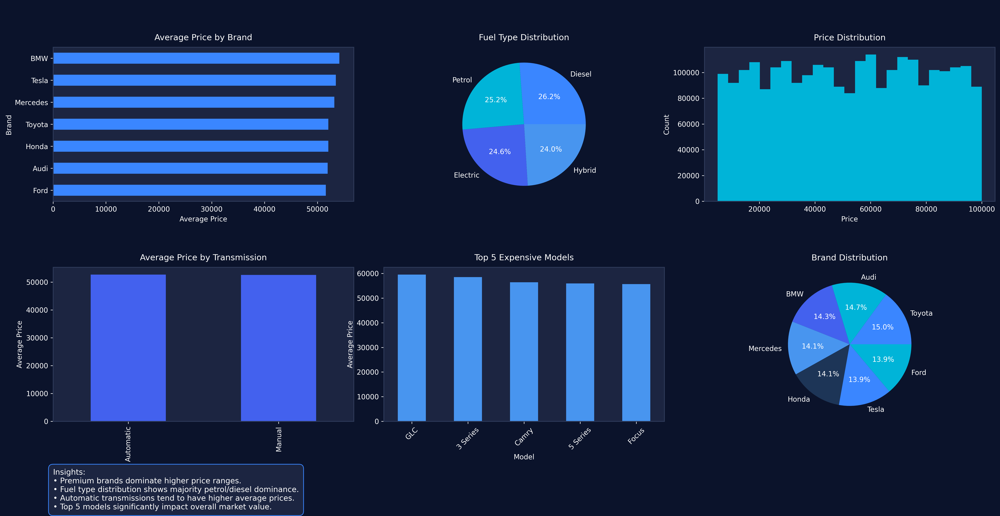

# Car Price Analysis using Hadoop Ecosystem

<p align="center">
  <b>Large-Scale Data Storage (LSDS) — Individual Project</b><br>
  Distributed storage, batch processing, SQL analytics, NoSQL storage, streaming, and visualization
</p>

<p align="center">
  
  
  
  
  
  
  
  
</p>

---

## Overview

**Car Price Analysis using Hadoop Ecosystem** is an individual **Large-Scale Data Storage (LSDS)** project that demonstrates how a large automobile dataset can be stored, processed, queried, transformed, streamed, and visualized using multiple technologies from the Hadoop ecosystem.

The project follows a complete data workflow:

**CSV Dataset → HDFS → MapReduce / Hive / Pig / HBase → Kafka Streaming → Python Analytics & Dashboards**

The objective is not simply to analyze car prices with Python. The project demonstrates how the same business dataset can move through different big-data technologies, with each component serving a specific role in the processing pipeline.

---

## Project Information

| Item | Details |
|---|---|
| Project | Car Price Analysis using Hadoop Ecosystem |
| Subject | Large-Scale Data Storage (LSDS) |
| Type | Individual / Solo Academic Project |
| Course | Big Data Analytics |
| Semester | 4th Semester |
| Student | Kuunal Mistry |
| Dataset | Car price and vehicle information |
| Approx. expanded dataset size | ~152 MB |
| Hadoop Environment | Hortonworks Data Platform (HDP) Sandbox |
| Virtualization | Oracle VirtualBox |

---

## Objectives

The project was developed to demonstrate the following big-data concepts:

- Store a large dataset using **HDFS**
- Process distributed data using **MapReduce**
- Perform SQL-style analysis using **Apache Hive**
- Transform and aggregate data using **Apache Pig**
- Store structured records using **Apache HBase**
- Simulate real-time ingestion using **Apache Kafka**
- Move streamed data into **HDFS** for further analysis
- Generate analytical charts and dashboards using **Python**
- Connect multiple Hadoop ecosystem components into a single workflow

---

## Technology Stack

### Core Big Data Technologies

| Technology | Role in the Project |
|---|---|
| **Hadoop HDFS** | Distributed storage of the car dataset |
| **MapReduce** | Batch processing and average-price aggregation |
| **Apache Hive** | SQL-like querying and analytical operations |
| **Apache Pig** | Data transformation and aggregation |
| **Apache HBase** | NoSQL storage for structured car records |
| **Apache Kafka** | Simulated real-time car-price data streaming |
| **YARN** | Hadoop resource management |
| **Ambari** | Hadoop service management and monitoring |
| **HDP Sandbox** | Local Hadoop environment |

### Analytics & Visualization

- Python
- Pandas
- Matplotlib
- Seaborn
- CSV-based data processing
- Dashboard generation

---

## System Architecture

The project combines batch processing, analytical querying, NoSQL storage, and streaming into one ecosystem.

```text
                         ┌───────────────────────┐
                         │   Car Price Dataset   │
                         │       CSV Data        │
                         └───────────┬───────────┘
                                     │
                                     ▼
                         ┌───────────────────────┐
                         │         HDFS          │
                         │ Distributed Storage   │
                         └───────────┬───────────┘
                                     │
              ┌──────────────────────┼──────────────────────┐
              │                      │                      │
              ▼                      ▼                      ▼
      ┌──────────────┐       ┌──────────────┐       ┌──────────────┐
      │  MapReduce   │       │     Hive     │       │      Pig     │
      │ Batch Process│       │ SQL Analysis │       │ Transformation│
      └──────┬───────┘       └──────┬───────┘       └──────┬───────┘
             │                      │                      │
             └──────────────┬───────┴──────────────┬───────┘
                            │                      │
                            ▼                      ▼
                    ┌──────────────┐       ┌──────────────┐
                    │    HBase     │       │    Python    │
                    │ NoSQL Storage│       │ Visualization│
                    └──────────────┘       └──────┬───────┘
                                                   │
                                                   ▼
                                          ┌─────────────────┐
                                          │    Dashboards   │
                                          │ & Business      │
                                          │    Insights     │
                                          └─────────────────┘


 Real-Time Pipeline

 ┌──────────┐     ┌──────────────┐     ┌──────────┐     ┌───────┐
 │ Producer │ ──► │ Kafka Topic  │ ──► │ Consumer │ ──► │ File  │
 └──────────┘     │car-price-topic│     └──────────┘     └───┬───┘
                  └──────────────┘                            │
                                                             ▼
                                                          ┌──────┐
                                                          │ HDFS │
                                                          └──┬───┘
                                                             ▼
                                                          ┌──────┐
                                                          │ Hive │
                                                          └──────┘
```

A generated architecture diagram is also included below:



---

# Data Pipeline

## 1. Dataset

The dataset contains vehicle and pricing information including:

- Car ID
- Brand
- Model
- Year
- Engine Size
- Fuel Type
- Transmission
- Mileage
- Condition
- Price

The repository also contains a smaller source CSV and a script for generating the expanded dataset used for large-scale processing.

> **GitHub note:** The expanded `car_price_big.csv` is approximately 160 MB on disk and therefore exceeds GitHub's standard 100 MB per-file limit. The repository should keep the large generated file out of normal Git history and retain the smaller source dataset plus `expand_dataset.py` for reproducibility.

---

# Hadoop Implementation

## Week 1 — Hadoop Environment Setup

The Hadoop environment was configured using the **Hortonworks Data Platform (HDP) Sandbox** inside Oracle VirtualBox.

Main activities:

- Installed Oracle VirtualBox
- Imported the HDP Sandbox virtual machine
- Configured the network
- Connected to the sandbox through SSH
- Verified Hadoop services through Ambari
- Prepared HDFS, YARN, Hive, Pig, HBase and Kafka

---

## Week 2 — HDFS Data Storage

The dataset was uploaded to HDFS for distributed storage.

Example commands:

```bash
hdfs dfs -mkdir /user/maria_dev/car_project

hdfs dfs -put car_price_dataset.csv /user/maria_dev/car_project

hdfs dfs -ls /user/maria_dev/car_project

hdfs dfs -cat /user/maria_dev/car_project/car_price_dataset.csv
```

### Purpose

HDFS provides a distributed storage layer suitable for large datasets and forms the storage foundation for the remaining Hadoop processing stages.

---

## Week 3 — MapReduce Processing

MapReduce was used to calculate the **average vehicle price by brand**.

### Processing flow

```text
Input Records
      │
      ▼
   Mapper
      │
      ├── Brand → Price
      │
      ▼
 Shuffle / Sort
      │
      ▼
  Reducer
      │
      ├── Group prices by brand
      ├── Calculate aggregate
      │
      ▼
Average Price by Brand
```

Example analytical output included brands such as:

- BMW
- Audi
- Ford
- Honda
- Tesla
- Toyota
- Mercedes

The MapReduce stage demonstrates distributed batch processing rather than relying only on local Python computation.

---

## Week 4 — Apache Hive

Hive was used to perform SQL-like analytical queries over data stored in HDFS.

### Average price by brand

```sql
SELECT brand, AVG(price)
FROM car_prices
GROUP BY brand;
```

### Top expensive vehicles

```sql
SELECT brand, model, price
FROM car_prices
ORDER BY price DESC
LIMIT 10;
```

Hive provided a structured query layer for exploring the dataset.

---

## Week 5 — Apache Pig

Apache Pig was used for data loading, grouping, transformation, and aggregation.

Example workflow:

```text
LOAD → GROUP BY BRAND → AGGREGATE PRICE → DUMP RESULT
```

Example Pig script:

```pig
cars = LOAD '/user/maria_dev/car_project/car_price_dataset.csv'
USING PigStorage(',')
AS (
    id:int,
    brand:chararray,
    year:int,
    engine:float,
    fuel:chararray,
    transmission:chararray,
    mileage:int,
    condition:chararray,
    price:float,
    model:chararray
);

grouped = GROUP cars BY brand;

avg_price = FOREACH grouped
GENERATE group, AVG(cars.price);

DUMP avg_price;
```

---

## Week 6 — Apache HBase

HBase was used as the NoSQL storage layer for structured vehicle records.

### Table

```text
car_price_hbase
```

### Column families

```text
basic
specs
```

### Example commands

```text
create 'car_price_hbase', 'basic', 'specs'
```

Example record:

```text
put 'car_price_hbase',
    'BMW_2018_1',
    'basic:brand',
    'BMW'
```

```text
put 'car_price_hbase',
    'BMW_2018_1',
    'basic:price',
    '54157'
```

```text
put 'car_price_hbase',
    'BMW_2018_1',
    'specs:engine',
    '3.0'
```

Records can then be inspected using:

```text
scan 'car_price_hbase'
```

---

# Real-Time Streaming with Apache Kafka

The project also demonstrates a streaming workflow using Kafka.

### Kafka pipeline

```text
Producer
   │
   ▼
car-price-topic
   │
   ▼
Consumer
   │
   ▼
car_data.txt
   │
   ▼
HDFS
   │
   ▼
Hive
   │
   ▼
Further Analysis
```

Example streamed records:

```text
Toyota,2018,450000
Honda,2020,600000
BMW,2022,2500000
```

This stage demonstrates how incoming vehicle-price events can be ingested through Kafka and subsequently moved into the Hadoop storage and analytical workflow.

---

# Python Analytics & Visualization

Python was used to generate analytical visualizations from the dataset.

### Generated analyses

| Visualization | Purpose |
|---|---|
| Average Price by Brand | Compare average pricing across brands |
| Fuel Type Distribution | Understand fuel composition |
| Transmission Distribution | Compare transmission categories |
| Car Condition Distribution | Examine vehicle condition |
| Average Price by Year | Observe pricing across model years |
| Top 5 Brands by Market Presence | Identify frequently represented brands |
| Price Range Distribution | Segment vehicles into price categories |
| Dashboard | Combine multiple analyses into one view |

---

# Dashboards

Several dashboard variants are included in the project:

- Standard Car Price Dashboard
- Power BI-style Dashboard
- Executive Dashboard
- Executive Dark Dashboard
- Executive Pro Dashboard

Example:



Architecture:


---

# Repository Structure

```text
Car-Price-Analysis-Hadoop/
│
├── Dataset/
│   ├── car_price_prediction_.csv
│   ├── car_price_big.csv                 # Large generated dataset
│   │
│   ├── Dashboards/
│   │   ├── graphs/
│   │   ├── car_dashboard.png
│   │   ├── dashboard.png
│   │   ├── executive_dark_dashboard.png
│   │   ├── executive_pro_dashboard.png
│   │   ├── powerbi_dashboard.png
│   │   └── project_architecture_professional.png
│   │
│   └── python files/
│       ├── architecture_diagram.py
│       ├── car_price_analysis.py
│       ├── dashboard.py
│       ├── executive_dashboard.py
│       ├── executive_dark_dashboard.py
│       ├── executive_pro_dashboard.py
│       ├── expand_dataset.py
│       ├── powerbi_style_dashboard.py
│       └── visuals_presentation.py
│
├── Individual Project ss/
│   ├── Week 2 ss/
│   ├── Week 3 ss/
│   ├── Week 4 ss/
│   ├── Week 5 ss/
│   ├── Week 6 ss/
│   ├── Week 7 ss/
│   └── kafka ss/
│
├── Project Instructions/
│   ├── Individual Project Instructions_LARGE SCALE DATA STORAGE.pdf
│   └── Individual Project weekly submission.pdf
│
├── Weekly Project Log/
│   ├── Week 1 Report...
│   ├── Week 2 Report...
│   ├── Week 3 Report...
│   ├── Week 4 Report...
│   ├── Week 5 Report...
│   ├── Week 6 Report...
│   ├── Week 7 Report...
│   └── Final Report/
│       └── Individual Project Final Report.pdf
│
├── .gitignore
├── requirements.txt
└── README.md
```

---

# Running the Python Visualizations

Install the Python dependencies:

```bash
pip install -r requirements.txt
```

Move into the directory containing the scripts and dataset, or update the CSV path in the scripts as required.

### Generate the expanded dataset

```bash
python "Dataset/python files/expand_dataset.py"
```

This reads:

```text
car_price_prediction_.csv
```

and generates:

```text
car_price_big.csv
```

### Generate presentation visuals

```bash
python "Dataset/python files/visuals_presentation.py"
```

### Generate the standard dashboard

```bash
python "Dataset/python files/dashboard.py"
```

### Generate the executive dashboard

```bash
python "Dataset/python files/executive_dashboard.py"
```

### Generate the dark executive dashboard

```bash
python "Dataset/python files/executive_dark_dashboard.py"
```

### Generate the Power BI-style dashboard

```bash
python "Dataset/python files/powerbi_style_dashboard.py"
```

### Generate the architecture diagram

```bash
python "Dataset/python files/architecture_diagram.py"
```

---

# Python Dependencies

The visualization layer uses:

```text
pandas
matplotlib
seaborn
numpy
```

The Hadoop ecosystem components are configured separately inside the HDP Sandbox environment.

---

# Key Analytical Insights

The project analysis identified several patterns in the dataset, including:

- BMW, Tesla, and Mercedes appeared among the higher-average-price brands in the analyzed dataset.
- Diesel vehicles represented a large portion of the fuel-type distribution.
- Manual transmission vehicles appeared slightly more frequently than automatic vehicles.
- Used vehicles represented the dominant condition category.
- Toyota had the highest representation by vehicle count.
- A substantial portion of vehicles fell within the mid-range price categories.

These observations describe the analyzed dataset and should not be interpreted as general conclusions about the entire automobile market.

---

# What This Project Demonstrates

This project brings together multiple big-data concepts in one workflow:

```text
                    ┌─────────────────────────┐
                    │     Data Generation      │
                    └────────────┬────────────┘
                                 │
                    ┌────────────▼────────────┐
                    │      HDFS Storage       │
                    └────────────┬────────────┘
                                 │
          ┌──────────────────────┼──────────────────────┐
          │                      │                      │
          ▼                      ▼                      ▼
     MapReduce                 Hive                    Pig
   Batch Processing        SQL Analytics       Transformation
          │                      │                      │
          └──────────────────────┼──────────────────────┘
                                 │
                                 ▼
                              HBase
                           NoSQL Storage

                                 +

                          Kafka Streaming
                                 │
                                 ▼
                               HDFS
                                 │
                                 ▼
                               Hive

                                 │
                                 ▼
                       Python Visualization
                                 │
                                 ▼
                            Dashboards
```

The project therefore demonstrates both **batch-oriented** and **stream-oriented** data workflows.

---

# Project Documentation

The repository includes weekly documentation covering the implementation stages:

- Week 1 — Hadoop environment setup
- Week 2 — HDFS storage
- Week 3 — MapReduce processing
- Week 4 — Hive analysis
- Week 5 — Pig processing
- Week 6 — HBase storage
- Week 7 — Kafka streaming and visualization
- Final Report — Complete project documentation

Screenshots of the implementation process are also included in `Individual Project ss/`.

---

# Limitations & Reproducibility

### Large Dataset

The expanded dataset is intentionally generated by duplicating the source dataset for large-scale Hadoop experimentation.

The script:

```text
Dataset/python files/expand_dataset.py
```

can regenerate the expanded CSV.

Because the generated file is larger than GitHub's standard per-file limit, it is recommended to keep it out of normal Git history and regenerate it locally when required.

### Hadoop Environment

The Hadoop components were implemented using the **HDP Sandbox** environment. Therefore, running the complete Hadoop pipeline requires a compatible Hadoop/HDP environment rather than only a standard Python installation.

### Streaming

Kafka was used to simulate real-time ingestion for the academic project. The streaming stage demonstrates the architecture and data flow rather than representing a production deployment.

---

# Learning Outcomes

Through this project, the following concepts were practically explored:

- Distributed file systems
- HDFS commands and data management
- MapReduce processing
- Data aggregation
- HiveQL
- Pig Latin
- NoSQL concepts with HBase
- Kafka producers and consumers
- Batch vs. streaming processing
- Hadoop ecosystem integration
- Python-based exploratory analysis
- Dashboard design
- Big-data workflow architecture

---

# Academic Workflow

```text
Week 1
Hadoop Environment
       ↓
Week 2
HDFS
       ↓
Week 3
MapReduce
       ↓
Week 4
Hive
       ↓
Week 5
Pig
       ↓
Week 6
HBase
       ↓
Week 7
Kafka + Visualization
       ↓
Final
Dashboard + Insights + Documentation
```

---

# Author

**Kuunal Mistry**

BTech — Artificial Intelligence / Machine Learning & Computer Science  
Individual LSDS Project — Semester 4

---

